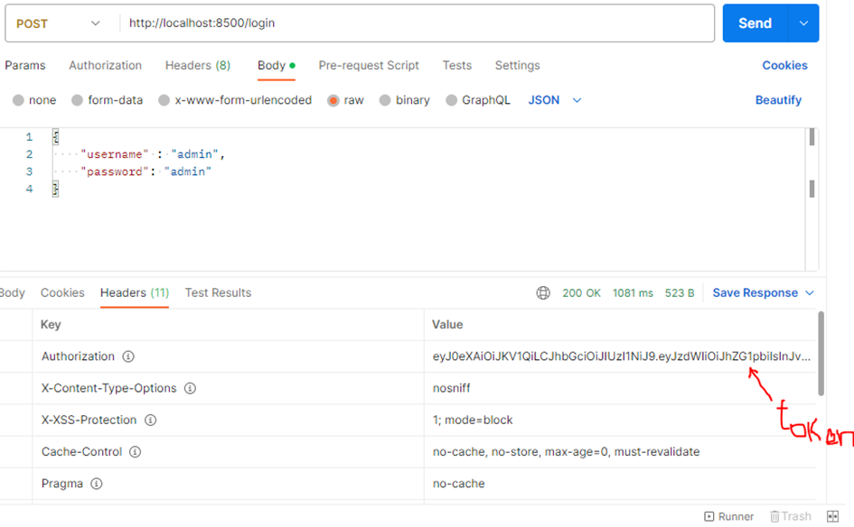
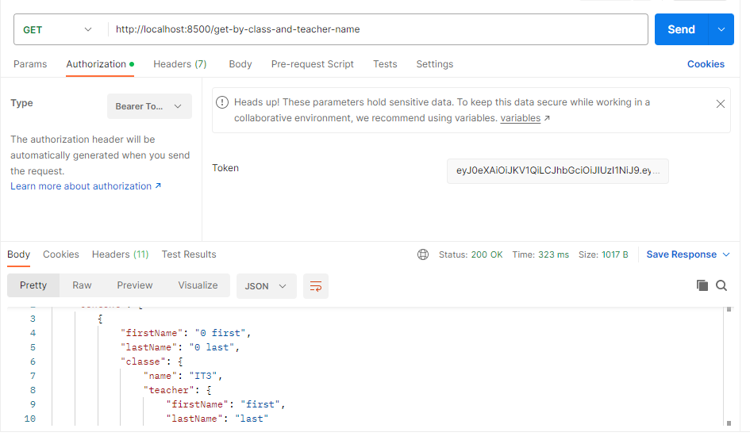
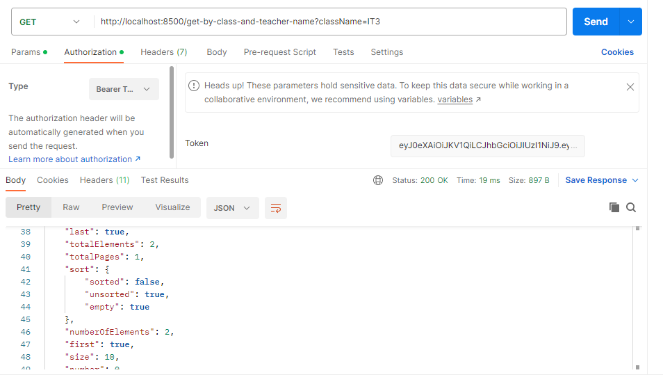
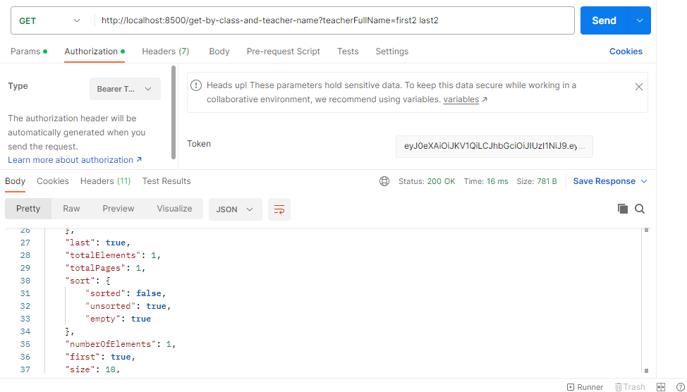
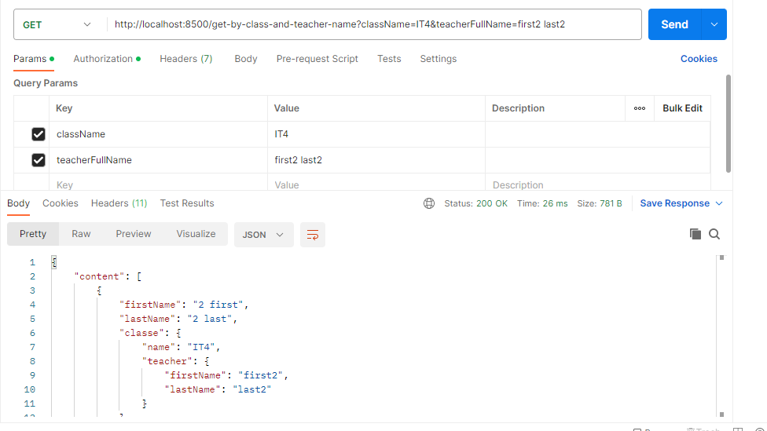

# Read Me First

### Setup du Projet
Le projet a été initialisé avec :

* version Spring Boot: 2.7.11
* version Java: 11
* Maven 
* Dépendances : lombok, spring Data JPA, spring Web, spring Security, H2...
* Le projet démarre avec une base de données H2 et les données enrégistrées grâce à un [CommandLineRunner](https://github.com/ONDAPHE/christian_ondaphe_e5awwojnyl/blob/develop/src/main/java/com/anywrtest/christianondaphee5awwojnyl/Application.java)

### Ressources 
Quelques ressources consultées :

* [Spring Boot Data JPA Joins](https://roytuts.com/spring-boot-data-jpa-left-right-inner-and-cross-join-examples/)
*  [Using the JPQL Native Queries](https://www.baeldung.com/jpql-hql-criteria-query#2-using-the-jpql-native-queries)
* [Using JWT with Spring Security OAuth](https://docs.spring.io/spring-security/reference/servlet/oauth2/resource-server/jwt.html)
* [Spring Data JPA](https://docs.spring.io/spring-boot/docs/3.1.0/reference/htmlsingle/#data.sql.jpa-and-spring-data)

### Outils
Les outils utilisés :

* IntelliJ IDEA 2022.2.1 (Ultimate Edition)
* Postman for Windows Version 10.14.2
* Internet
### Démarrage de l'application et Test de l'API
A l'aide d'un outil de test telque postman, lancer URL suivant :  http://localhost:8500/login avec username=admin et password=admin; un Token sera généré.

Faire un test sans paramètres en renseignant le Token : http://localhost:8500/get-by-class-and-teacher-name
On obtient la liste de tous les élèves.

Test avec comme paramètre le nom de la classe : http://localhost:8500/get-by-class-and-teacher-name?className=IT3

Test avec comme paramètre le nom complet de l'enseignant : http://localhost:8500/get-by-class-and-teacher-name?teacherFullName=first2 last2

Test avec comme paramètre le nom de la classe et le nom complet de l'enseignant : http://localhost:8500/get-by-class-and-teacher-name?className=IT4&teacherFullName=first2 last2

  

